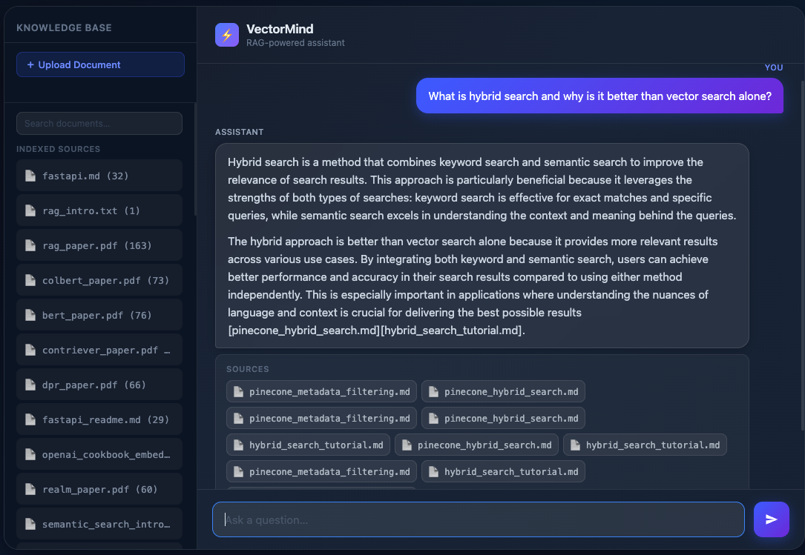
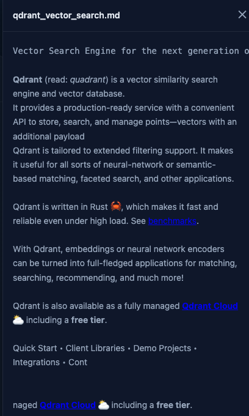
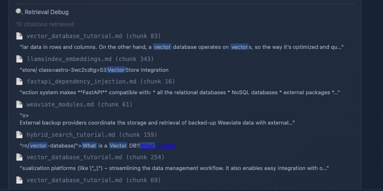

# VectorMind

**Production-Ready Retrieval-Augmented Generation System**

A full-stack RAG system with hybrid retrieval, MMR diversity re-ranking, LLM-based reranking, streaming responses, and chunk-level citation tracing. Built to demonstrate what a production-style retrieval pipeline looks like beyond the typical "embed + cosine similarity" demo.

---

## What It Does

Upload documents (PDF, TXT, Markdown). Ask questions. Get grounded answers streamed back in real time, with citations linked to the exact chunk in the source document. A collapsible debug panel exposes the retrieval internals for every response — which chunks were pulled, from where, and what they contain.

---

## Key Features

| Feature | Detail |
|---|---|
| **Hybrid retrieval** | BM25 keyword search + ChromaDB vector search, fused at 0.7/0.3 |
| **MMR re-ranking** | Maximal Marginal Relevance removes redundant chunks (λ=0.7) |
| **LLM reranker** | GPT-4o-mini picks the top 3 candidates before context assembly |
| **Context compression** | Sentence-level extraction + Jaccard deduplication before the prompt |
| **Query rewriting** | Standalone query synthesis from conversation history |
| **Streaming responses** | Server-Sent Events via FastAPI `StreamingResponse` |
| **Chunk-level citations** | Every citation links to its exact chunk in the document drawer |
| **Retrieval Debug Panel** | Per-response panel showing citation count, source, chunk ID, and snippet with query-term highlights |
| **Document upload** | PDF, TXT, MD — chunked, embedded, and indexed on the fly |
| **Multi-turn conversation** | Full history passed to the LLM; rewriter resolves coreferences |

---

## What Makes This Different

Most RAG demos:

- Retrieve top-k chunks using vector similarity only
- Provide vague or non-clickable citations
- Hide retrieval decisions from the user

VectorMind:

- Uses hybrid retrieval (BM25 + vector) to handle vocabulary mismatch
- Applies MMR to prevent redundant context (retrieval collapse)
- Uses an LLM reranker to select the most relevant final context
- Exposes chunk-level citations with direct navigation
- Includes a Retrieval Debug Panel to make retrieval behavior transparent

This is not just a chatbot — it is a debuggable retrieval system.

---

## Architecture

```
User Query
    │
    ▼
Query Rewriter (GPT-4o-mini)          ← resolves pronouns / conversation context
    │
    ├─► OpenAI Embeddings              ← text-embedding-3-small (1536 dims)
    │       │
    │       ▼
    │   ChromaDB Vector Search         ← cosine similarity, top-10
    │
    └─► BM25 Keyword Search            ← rank_bm25, full corpus, top-10
            │
            ▼
        Score Fusion                   ← 0.7 × vector_sim + 0.3 × bm25
            │
            ▼
        MMR Re-ranking                 ← relevance vs. diversity, λ=0.7
            │
            ▼
        LLM Reranker (GPT-4o-mini)     ← top-3 selection from candidates
            │
            ▼
        Context Compression            ← sentence scoring + deduplication
            │
            ▼
        GPT-4o-mini (streaming)        ← system prompt enforces inline citations
            │
            ▼
        UI Rendering + Citations       ← Markdown, citation chips, debug panel
```

---

## Tech Stack

**Backend**
- Python 3.12
- FastAPI + Uvicorn
- ChromaDB (persistent local vector store)
- rank_bm25 (BM25Okapi)
- OpenAI SDK (embeddings + chat completions)
- pypdf (PDF text extraction)
- python-dotenv

**AI**
- Embedding model: `text-embedding-3-small`
- Generation + reranking: `gpt-4o-mini`

**Frontend**
- Vanilla JS, HTML, CSS — zero frameworks, single file (`ui/index.html`)
- marked.js for Markdown rendering

---

## How It Works

### 1. Ingestion

`vectormind/ingest.py` reads `.txt`, `.md`, and `.pdf` files. PDF text is extracted page-by-page via pypdf. The upload endpoint accepts files at runtime, processes them in a temp directory, and indexes them without a server restart.

### 2. Chunking

`vectormind/chunk.py` splits documents into overlapping character-based chunks. Pipeline default: 500 chars / 50 overlap. Upload path: 1000 chars / 150 overlap to handle longer uploaded documents.

```python
{"text": "...", "source": "rag_paper.pdf", "chunk_id": 12}
```

### 3. Embedding

`vectormind/embed.py` calls the OpenAI embeddings API in a single batched request per document. Each chunk gets a 1536-dimensional vector stored alongside its metadata in ChromaDB.

```python
{"text": "...", "source": "rag_paper.pdf", "chunk_id": 12, "embedding": [float, ...]}
```

IDs are formatted as `{source}_{chunk_id}` and upserted, so re-indexing the same file is idempotent.

### 4. Retrieval

`vectormind/retrieve.py` runs a five-stage pipeline on every query:

1. **Query rewriting** — GPT-4o-mini expands the query into a keyword-rich search form
2. **Vector search** — ChromaDB cosine similarity, top-10 results with embeddings included
3. **BM25 keyword search** — full corpus loaded into a lazily-built, cached BM25Okapi index
4. **Score fusion** — candidates merged and scored: `0.7 × vector_sim + 0.3 × bm25_score`
5. **MMR re-ranking** — iteratively selects the candidate that maximises `λ × relevance − (1−λ) × similarity_to_already_selected`

The BM25 index is rebuilt only when new documents are ingested (`invalidate_bm25_cache()`).

### 5. Reranking & Context Assembly

`vectormind/answer.py` takes the MMR-selected candidates through two more stages:

- **LLM reranker** — GPT-4o-mini scores all candidates in a single call and returns the top 3 document numbers
- **Context compression** — sentences are scored by query-token overlap, sorted, and the top 7 extracted
- **Deduplication** — Jaccard similarity (>0.7 overlap) removes near-duplicate sentences before the final context is assembled

### 6. Generation

The LLM receives a system prompt that enforces inline source citations in the format `[filename]`. The answer streams back token-by-token via `StreamingResponse`. Conversation history is included so follow-up questions resolve correctly.

---

## Demo

### Chat + Sources + Knowledge Base

Full system view showing streaming responses and grounded citations.



---

### Chunk-Level Citation Navigation

Clicking a citation opens the exact document chunk used during retrieval.



---

### Retrieval Debug Panel

Shows which chunks were retrieved, including source, chunk ID, and snippet.



---

## Running Locally

**Prerequisites:** Python 3.12, an OpenAI API key.

```bash
# 1. Clone and install
git clone https://github.com/you/vectormind.git
cd vectormind
pip install -r requirements.txt

# 2. Set your API key
echo "OPENAI_API_KEY=sk-..." > .env

# 3. (Optional) Pre-index documents in data/docs/
python -m vectormind.pipeline

# 4. Start the API server
uvicorn api.server:app --reload

# 5. Serve the UI (separate terminal)
cd ui
python3 -m http.server 3000
```

Open `http://localhost:3000` and start asking questions.

Documents can also be uploaded directly from the UI sidebar at runtime.

---

## API Endpoints

| Method | Path | Description |
|---|---|---|
| `POST` | `/query` | Streaming RAG response |
| `POST` | `/retrieve` | Retrieve citations for a query without generating |
| `POST` | `/upload` | Ingest a document (PDF, TXT, MD) |
| `GET` | `/library` | List indexed sources with chunk counts |
| `POST` | `/library-search` | Semantic search over the document library |
| `GET` | `/documents/{source}` | Raw document content for the preview drawer |
| `DELETE` | `/documents/{source}` | Remove a source from the vector store |
| `POST` | `/reindex` | Invalidate the BM25 cache |
| `GET` | `/health` | Health check |

---

## Example Query

**Input:** *What is maximal marginal relevance and why does it matter for RAG?*

**Response (streamed):** A grounded answer with inline citations like `[mmr_paper.pdf]`.

**Sources panel:** Clickable chips — each opens the document drawer scrolled to the exact chunk.

**Retrieval Debug Panel** (collapsed by default):
```
3 citations retrieved
📄 mmr_paper.pdf (chunk 4)
   "Maximal Marginal Relevance selects documents that are both relevant to the query and..."
📄 rag_survey.pdf (chunk 11)
   "Diversity in retrieval is critical when documents are semantically redundant..."
📄 information_retrieval.pdf (chunk 2)
   "Classical retrieval measures such as MAP do not penalise redundancy in the result set..."
```
Query terms are highlighted in each snippet.

---

## Why This Matters

Most RAG demos do one thing: embed a query, find the nearest vectors, stuff them into a prompt. That works for toy corpora. It breaks on real document sets where:

- The most relevant chunks are semantically similar to each other (retrieval collapse)
- Keyword-heavy queries don't embed well (vocabulary mismatch)
- Conversational follow-ups lose their original intent without rewriting
- Users have no way to verify where an answer came from

VectorMind addresses each of these with a concrete implementation — not config flags or library abstractions, but code you can read in `retrieve.py` and `answer.py`.

The Retrieval Debug Panel makes the retrieval decision visible to the user on every response. That matters in any domain where answer provenance is important.

---

## Project Structure

```
vectormind/
├── ingest.py          # Document loading (TXT, MD, PDF)
├── chunk.py           # Overlapping character-based chunking
├── embed.py           # OpenAI embeddings (batched)
├── vector_store.py    # ChromaDB persistence layer
├── retrieve.py        # Hybrid retrieval + MMR (full pipeline)
├── answer.py          # Reranking, compression, streaming generation
└── pipeline.py        # Offline batch ingestion script

api/
└── server.py          # FastAPI application

ui/
└── index.html         # Chat UI, document drawer, debug panel

data/docs/             # Drop documents here for batch indexing
```

---

## Future Work

- [ ] Configurable hybrid weight (currently hardcoded 0.7/0.3)
- [ ] Cross-encoder reranking (e.g. `cross-encoder/ms-marco-MiniLM`)
- [ ] Docker Compose deployment (API + UI + persistent Chroma volume)
- [ ] Streaming citations (surface sources as they are referenced mid-response)
- [ ] Evaluation harness (RAGAS or custom precision/recall against a labeled set)
- [ ] Authentication and per-user document namespacing

---

## License

MIT
